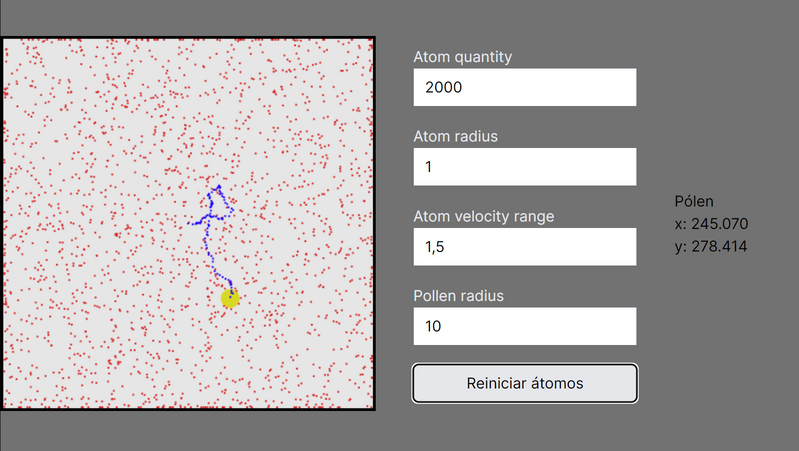

# Brownian Motion Simulator

**[Access the webpage](http://jonrc-simulator.s3-website-sa-east-1.amazonaws.com/)**  
http://jonrc-simulator.s3-website-sa-east-1.amazonaws.com/

## Description
  This **open source project** is a simulator webpage of the Brownian Motion.  
  The technology used are [Typescript (Javascript)](https://www.typescriptlang.org/), [Next.js](https://nextjs.org/), [Matter.js (physics engine)](https://brm.io/matter-js/), HTML and CSS.

## Contribution
Do you know Javascript? Let's make this better!  
Open an issue or a pull request.

### TODO list
- [ ] Create a description about the Brownian Motion with references
- [ ] Make the collision with the wall better
- [ ] To limit simulator parameters to avoid invalid values
- [ ] Make the UI design better
- [ ] Add more simulator params to the UI
- [ ] User can start and stop the simulation
- [ ] User can export the simulation data (pollen position, time)
- [ ] User can reset the trajectory
- [ ] User can reset pollen position
- [ ] Add Eslint and Prettier for React and Tailwind